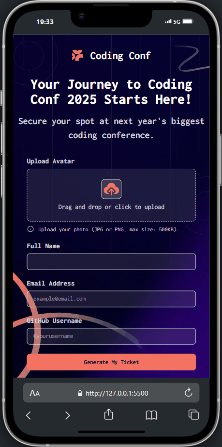
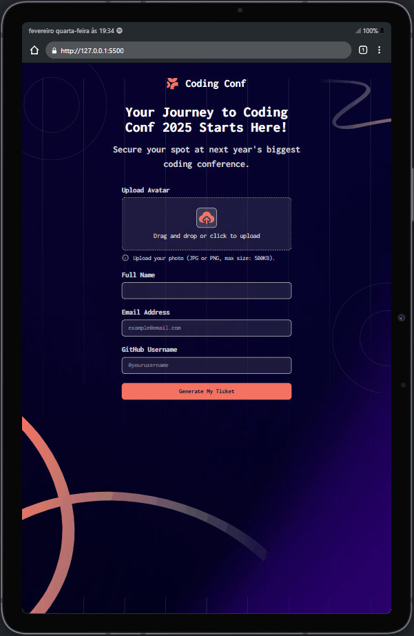

# Gerador de ticket para evento 

Este projeto consiste em um gerador de ticket para um determinado evento, conforme o usuário preenche o formulário com seus dados, o ticket irá possuir as informações, foi utilizado as seguintes tecnologias: HTML, CSS, JavaScript, o site é todo responsivo para todos os tipos de plataformas, o site está disponível para visualização no GitHub pages.

## Screenshot 
Desktop 💻

Mobile 📱

Tablet 📱

## Tecnologias utilizadas 👨💻
- HTML
- CSS
- JAVASCRIPT